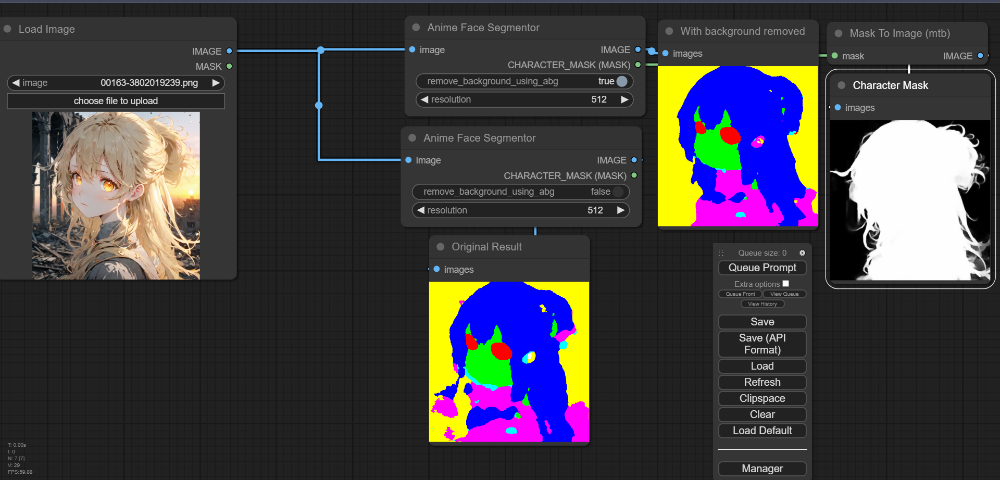

# ComfyUI's ControlNet Auxiliary Preprocessors

This is a rework of [comfyui_controlnet_preprocessors](https://github.com/Fannovel16/comfy_controlnet_preprocessors) based on [ControlNet auxiliary models by 🤗](https://github.com/patrickvonplaten/controlnet_aux). I think the old repo isn't good enough to maintain.

YOU NEED TO REMOVE `comfyui_controlnet_preprocessors` BEFORE USING THIS REPO. THESE TWO CONFLICT WITH EACH OTHER. 

All old workflows still can be used with custom nodes in this repo but the version option won't do anything. Almost all v1 preprocessors are replaced by v1.1 except those doesn't apppear in v1.1.

You don't need to care about the differences between v1 and v1.1 lol.

The code is copy-pasted from the respective folders in https://github.com/lllyasviel/ControlNet/tree/main/annotator and connected to [the 🤗 Hub](https://huggingface.co/lllyasviel/Annotators).

All credit & copyright goes to https://github.com/lllyasviel.

# Updates
* `AIO Aux Preprocessor` intergrating all loadable aux preprocessors as dropdown options. Easy to copy, paste and get the preprocessor faster.
* Added OpenPose-format JSON output from OpenPose Preprocessor and DWPose Preprocessor. Checks [here](#faces-and-poses).
* Fixed wrong model path when downloading DWPose.
* Make hint images less blurry.
* Added `resolution` option, `PixelPerfectResolution` and `HintImageEnchance` nodes (TODO: Documentation).
* Added `RAFT Optical Flow Embedder` for TemporalNet2 (TODO: Workflow example).
* Fixed opencv's conflicts between this extension, [ReActor](https://github.com/Gourieff/comfyui-reactor-node) and Roop. Thanks `Gourieff` for [the solution](https://github.com/Fannovel16/comfyui_controlnet_aux/issues/7#issuecomment-1734319075)!
* RAFT is removed as the code behind it doesn't match what what the original code does
* Changed `lineart`'s display name from `Normal Lineart` to `Realistic Lineart`. This change won't affect old workflows
* Added support for `onnxruntime` to speed-up DWPose (see the Q&A)
* Fixed TypeError: expected size to be one of int or Tuple[int] or Tuple[int, int] or Tuple[int, int, int], but got size with types [<class 'numpy.int64'>, <class 'numpy.int64'>]: [Issue](https://github.com/Fannovel16/comfyui_controlnet_aux/issues/2), [PR](https://github.com/Fannovel16/comfyui_controlnet_aux/pull/71))
* Fixed ImageGenResolutionFromImage mishape (https://github.com/Fannovel16/comfyui_controlnet_aux/pull/74)
* Fixed LeRes and MiDaS's incomatipility with MPS device
* Fixed checking DWPose onnxruntime session multiple times: https://github.com/Fannovel16/comfyui_controlnet_aux/issues/89)
* Added `Anime Face Segmentor` (in `ControlNet Preprocessors/Semantic Segmentation`) for [ControlNet AnimeFaceSegmentV2](https://huggingface.co/bdsqlsz/qinglong_controlnet-lllite#animefacesegmentv2). Checks [here](#anime-face-segmentor)
* Change download functions and fix [download error](https://github.com/Fannovel16/comfyui_controlnet_aux/issues/39): [PR](https://github.com/Fannovel16/comfyui_controlnet_aux/pull/96)
* Caching DWPose Onnxruntime during the first use of DWPose node instead of ComfyUI startup
* Added alternative YOLOX models for faster speed when using DWPose
* Added alternative DWPose models
* Implemented the preprocessor for [AnimalPose ControlNet](https://github.com/abehonest/ControlNet_AnimalPose/tree/main). Check [Animal Pose AP-10K](#animal-pose-ap-10k) 
* Added YOLO-NAS models which are drop-in replacements of YOLOX
* Fixed Openpose Face/Hands no longer detecting: https://github.com/Fannovel16/comfyui_controlnet_aux/issues/54
* Added TorchScript implementation of DWPose and AnimalPose
# Q&A:
## Why some nodes doesn't appear after I installed this repo?

This repo has a new mechanism which will skip any custom node can't be imported. If you meet this case, please create a issue on [Issues tab](https://github.com/Fannovel16/comfyui_controlnet_aux/issues) with the log from the command line.

## DWPose/AnimalPose only uses CPU so it's so slow. How can I make it use GPU?
There are two ways to speed-up DWPose: using TorchScript checkpoints (.torchscript.pt) checkpoints or ONNXRuntime (.onnx). TorchScript way is little bit slower than ONNXRuntime but doesn't require any additional library and still way way faster than CPU. 

A torchscript bbox detector is compatiable with an onnx pose estimator and vice versa.
### TorchScript
Set `bbox_detector` and `pose_estimator` according to this picture. You can try other bbox detector endings with `.torchscript.pt` to reduce bbox detection time if input images are ideal.

### ONNXRuntime
If onnxruntime is installed successfully and the checkpoint used endings with `.onnx`, it will replace default cv2 backend to take advantage of GPU. Note that if you are using NVidia card, this method currently can only works on CUDA 11.8 (ComfyUI_windows_portable_nvidia_cu118_or_cpu.7z) unless you compile onnxruntime yourself.

1. Know your onnxruntime build:
* * NVidia/AMD GPU: `onnxruntime-gpu`
* * DirectML: `onnxruntime-directml`
* * OpenVINO: `onnxruntime-openvino`

Note that if this is your first time using ComfyUI, please test if it can run on your device before doing next steps.

2. Add it into `requirements.txt`

3. Run `install.bat` or pip command mentioned in Installation


# Installation:
## Using ComfyUI Manager (recommended):
Install [ComfyUI Manager](https://github.com/ltdrdata/ComfyUI-Manager) and do steps introduced there to install this repo.

## Alternative:
If you're running on Linux, or non-admin account on windows you'll want to ensure `/ComfyUI/custom_nodes` and `comfyui_controlnet_aux` has write permissions.

There is now a **install.bat** you can run to install to portable if detected. Otherwise it will default to system and assume you followed ConfyUI's manual installation steps. 

If you can't run **install.bat** (e.g. you are a Linux user). Open the CMD/Shell and do the following:
  - Navigate to your `/ComfyUI/custom_nodes/` folder
  - Run `git clone https://github.com/Fannovel16/comfyui_controlnet_aux/`
  - Navigate to your `comfyui_controlnet_aux` folder
    - Portable/venv:
       - Run `path/to/ComfUI/python_embeded/python.exe -s -m pip install -r requirements.txt`
	- With system python
	   - Run `pip install -r requirements.txt`
  - Start ComfyUI

# Nodes
Please note that this repo only supports preprocessors making hint images (e.g. stickman, canny edge, etc).
All preprocessors except Inpaint are intergrated into `AIO Aux Preprocessor` node. 
This node allow you to quickly get the preprocessor but a preprocessor's own threshold parameters won't be able to set.
You need to use its node directly to set thresholds.

## Line Extractors
* Binary Lines
* Canny Edge
* HED Lines
* Realistic Lineart (formerly Normal Lineart)
* Anime Lineart
* Manga Lineart
* M-LSD Lines
* PiDiNet Lines
* Scribble Lines
* Scribble XDoG Lines

## Normal and Depth Map
* LeReS - Depth Map
* MiDaS - Normal Map
* MiDaS - Depth Map
* BAE - Normal Map
* Zoe - Depth Map

## Faces and Poses
* DWPose Pose Estimation
* OpenPose Pose Estimation
* MediaPipe Face Mesh
* Animal Pose Estimation

You can get [OpenPose-format JSON](https://github.com/CMU-Perceptual-Computing-Lab/openpose/blob/master/doc/02_output.md#json-output-format) from DWPose and OpenPose through two ways

For extension developers (e.g. Openpose editor):
```js
const poseNodes = app.graph._nodes.filter(node => ["OpenposePreprocessor", "DWPreprocessor"].includes(node.type))
for (const poseNode of poseNodes) {
    const openpose = JSON.parse(app.nodeOutputs[poseNode.id].openpose_json[0])
    console.log(openpose)
}
```

For API users:
Javascript
```js
import fetch from "node-fetch" //Remember to add "type": "module" to "package.json"
async function main() {
    const promptId = '792c1905-ecfe-41f4-8114-83e6a4a09a9f' //Too lazy to POST /queue
    let history = await fetch(`http://127.0.0.1:8188/history/${promptId}`).then(re => re.json())
    history = history[promptId]
    const nodeOutputs = Object.values(history.outputs).filter(output => output.openpose_json)
    for (const nodeOutput of nodeOutputs) {
        const openpose = JSON.parse(nodeOutput.openpose_json[0])
        console.log(openpose)
    }
}
main()
```

Python
```py
import json, urllib.request

server_address = "127.0.0.1:8188"
prompt_id = '' #Too lazy to POST /queue

def get_history(prompt_id):
    with urllib.request.urlopen("http://{}/history/{}".format(server_address, prompt_id)) as response:
        return json.loads(response.read())

history = get_history(prompt_id)[prompt_id]
for o in history['outputs']:
    for node_id in history['outputs']:
        node_output = history['outputs'][node_id]
        if 'openpose_json' in node_output:
            print(json.loads(node_output['openpose_json'][0]))
```
## Semantic Segmentation
* OneFormer ADE20K Segmentor
* UniFormer Segmentor
* OneFormer COCO Segmentor

## T2IAdapter-only
* Color Pallete
* Content Shuffle

# Examples
> A picture is worth a thousand words

Credit to https://huggingface.co/thibaud/controlnet-sd21. You can get the same kind of results from preprocessor nodes of this repo.
## Line Extractors
### Canny Edge

### HED Lines

### Realistic Lineart

### Scribble/Fake Scribble


## Normal and Depth Map
### Depth (idk the preprocessor they use)

## Zoe - Depth Map

## BAE - Normal Map


## Faces and Poses
### OpenPose


### Animal Pose (AP-10K)


## Semantic Segmantation
### OneFormer ADE20K Segmentor


### Anime Face Segmentor


## T2IAdapter-only
### Color Pallete for T2I-Adapter


# Testing workflow
https://github.com/Fannovel16/comfyui_controlnet_aux/blob/master/tests/test_cn_aux_full.json

