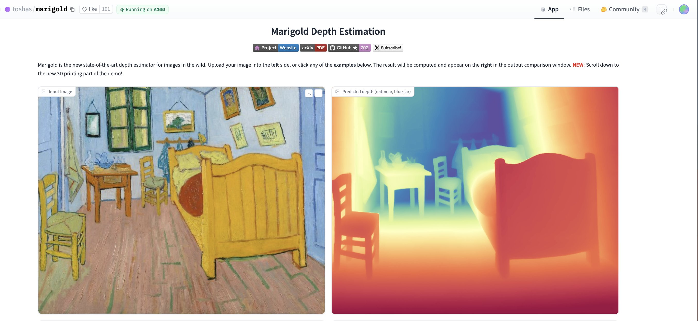
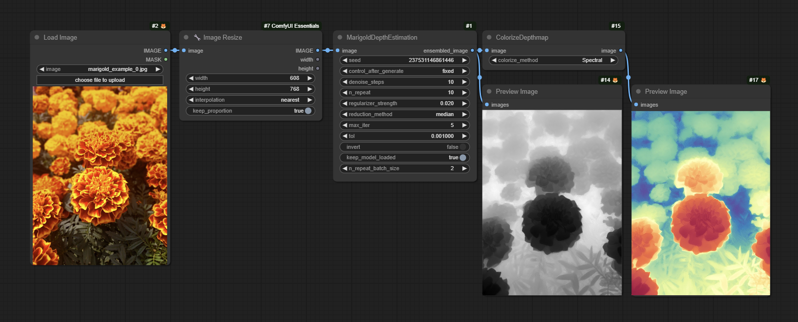
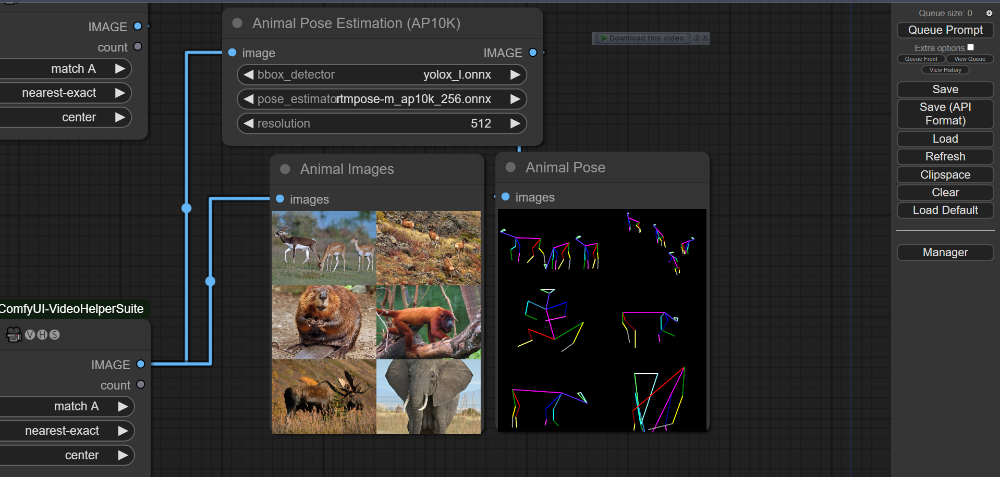
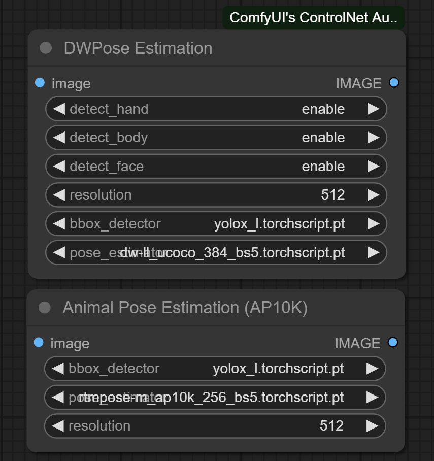
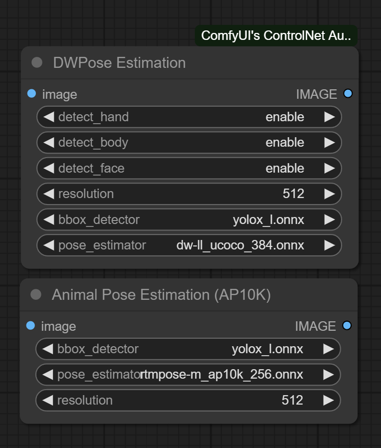

# ComfyUI's ControlNet Auxiliary Preprocessors

This is a rework of [comfyui_controlnet_preprocessors](https://github.com/Fannovel16/comfy_controlnet_preprocessors) based on [ControlNet auxiliary models by 🤗](https://github.com/patrickvonplaten/controlnet_aux). I think the old repo isn't good enough to maintain.

YOU NEED TO REMOVE `comfyui_controlnet_preprocessors` BEFORE USING THIS REPO. THESE TWO CONFLICT WITH EACH OTHER. 

All old workflows still can be used with custom nodes in this repo but the version option won't do anything. Almost all v1 preprocessors are replaced by v1.1 except those doesn't apppear in v1.1.

You don't need to care about the differences between v1 and v1.1 lol.

The code is copy-pasted from the respective folders in https://github.com/lllyasviel/ControlNet/tree/main/annotator and connected to [the 🤗 Hub](https://huggingface.co/lllyasviel/Annotators).

All credit & copyright goes to https://github.com/lllyasviel.

# Marigold
**NEW!** Check out Marigold Depth Estimator which can generate very detailed and sharp depth map from high-resolution images. The mesh created by it is even 3D-printable. Due to diffusers, it can't be implemented in this extension but there is an Comfy implementation by Kijai
https://github.com/kijai/ComfyUI-Marigold




# Updates
Go to [Update page](./UPDATES.md) to follow updates

# Installation:
## Using ComfyUI Manager (recommended):
Install [ComfyUI Manager](https://github.com/ltdrdata/ComfyUI-Manager) and do steps introduced there to install this repo.

## Alternative:
If you're running on Linux, or non-admin account on windows you'll want to ensure `/ComfyUI/custom_nodes` and `comfyui_controlnet_aux` has write permissions.

There is now a **install.bat** you can run to install to portable if detected. Otherwise it will default to system and assume you followed ConfyUI's manual installation steps. 

If you can't run **install.bat** (e.g. you are a Linux user). Open the CMD/Shell and do the following:
  - Navigate to your `/ComfyUI/custom_nodes/` folder
  - Run `git clone https://github.com/Fannovel16/comfyui_controlnet_aux/`
  - Navigate to your `comfyui_controlnet_aux` folder
    - Portable/venv:
       - Run `path/to/ComfUI/python_embeded/python.exe -s -m pip install -r requirements.txt`
	- With system python
	   - Run `pip install -r requirements.txt`
  - Start ComfyUI

# Nodes
Please note that this repo only supports preprocessors making hint images (e.g. stickman, canny edge, etc).
All preprocessors except Inpaint are intergrated into `AIO Aux Preprocessor` node. 
This node allow you to quickly get the preprocessor but a preprocessor's own threshold parameters won't be able to set.
You need to use its node directly to set thresholds.

# Nodes (sections are categories in Comfy menu)
## Line Extractors
| Preprocessor Node           | sd-webui-controlnet/other |          ControlNet/T2I-Adapter           |
|-----------------------------|---------------------------|-------------------------------------------|
| Binary Lines                | binary                    | control_scribble                          |
| Canny Edge                  | canny                     | control_v11p_sd15_canny <br> control_canny <br> t2iadapter_canny |
| HED Lines                   | hed                       | control_v11p_sd15_softedge <br> control_hed |
| Standard Lineart            | standard_lineart          | control_v11p_sd15_lineart                 |
| Realistic Lineart           | lineart (or `lineart_coarse` if `coarse` is enabled) | control_v11p_sd15_lineart |
| Anime Lineart               | lineart_anime             | control_v11p_sd15s2_lineart_anime         |
| Manga Lineart               | lineart_anime_denoise     | control_v11p_sd15s2_lineart_anime         |
| M-LSD Lines                 | mlsd                      | control_v11p_sd15_mlsd <br> control_mlsd  |
| PiDiNet Lines               | pidinet                   | control_v11p_sd15_softedge <br> control_scribble |
| Scribble Lines              | scribble                  | control_v11p_sd15_scribble <br> control_scribble |
| Scribble XDoG Lines         | scribble_xdog             | control_v11p_sd15_scribble <br> control_scribble |
| Fake Scribble Lines         | scribble_hed              | control_v11p_sd15_scribble <br> control_scribble |

## Normal and Depth Estimators
| Preprocessor Node           | sd-webui-controlnet/other |          ControlNet/T2I-Adapter           |
|-----------------------------|---------------------------|-------------------------------------------|
| MiDaS Depth Map           | (normal) depth            | control_v11f1p_sd15_depth <br> control_depth <br> t2iadapter_depth |
| LeReS Depth Map           | depth_leres               | control_v11f1p_sd15_depth <br> control_depth <br> t2iadapter_depth |
| Zoe Depth Map             | depth_zoe                 | control_v11f1p_sd15_depth <br> control_depth <br> t2iadapter_depth |
| MiDaS Normal Map          | normal_map                | control_normal                            |
| BAE Normal Map            | normal_bae                | control_v11p_sd15_normalbae               |
| MeshGraphormer Hand Refiner ([HandRefinder](https://github.com/wenquanlu/HandRefiner))  |               | [control_sd15_inpaint_depth_hand_fp16](https://huggingface.co/hr16/ControlNet-HandRefiner-pruned/blob/main/control_sd15_inpaint_depth_hand_fp16.safetensors) |

## Faces and Poses Estimators
| Preprocessor Node           | sd-webui-controlnet/other |          ControlNet/T2I-Adapter           |
|-----------------------------|---------------------------|-------------------------------------------|
| DWPose Estimator                 | dw_openpose_full          | control_v11p_sd15_openpose <br> control_openpose <br> t2iadapter_openpose |
| OpenPose Estimator               | openpose (detect_body) <br> openpose_hand (detect_body + detect_hand) <br> openpose_faceonly (detect_face) <br> openpose_full (detect_hand + detect_body + detect_face)    | control_v11p_sd15_openpose <br> control_openpose <br> t2iadapter_openpose |
| MediaPipe Face Mesh         | mediapipe_face            | controlnet_sd21_laion_face_v2             | 
| Animal Estimator                 | animal_openpose           | [control_sd15_animal_openpose_fp16](https://huggingface.co/huchenlei/animal_openpose/blob/main/control_sd15_animal_openpose_fp16.pth) |

An array of [OpenPose-format JSON](https://github.com/CMU-Perceptual-Computing-Lab/openpose/blob/master/doc/02_output.md#json-output-format) corresponsding to each frame in an IMAGE batch can be gotten from DWPose and OpenPose using `app.nodeOutputs` on the UI or `/history` API endpoint. JSON output from AnimalPose uses a kinda similar format to OpenPose JSON:
```
[
    {
        "version": "ap10k",
        "animals": [
            [[x1, y1, 1], [x2, y2, 1],..., [x17, y17, 1]],
            [[x1, y1, 1], [x2, y2, 1],..., [x17, y17, 1]],
            ...
        ],
        "canvas_height": 512,
        "canvas_width": 768
    },
    ...
]
```

For extension developers (e.g. Openpose editor):
```js
const poseNodes = app.graph._nodes.filter(node => ["OpenposePreprocessor", "DWPreprocessor", "AnimalPosePreprocessor"].includes(node.type))
for (const poseNode of poseNodes) {
    const openposeResults = JSON.parse(app.nodeOutputs[poseNode.id].openpose_json[0])
    console.log(openposeResults) //An array containing Openpose JSON for each frame
}
```

For API users:
Javascript
```js
import fetch from "node-fetch" //Remember to add "type": "module" to "package.json"
async function main() {
    const promptId = '792c1905-ecfe-41f4-8114-83e6a4a09a9f' //Too lazy to POST /queue
    let history = await fetch(`http://127.0.0.1:8188/history/${promptId}`).then(re => re.json())
    history = history[promptId]
    const nodeOutputs = Object.values(history.outputs).filter(output => output.openpose_json)
    for (const nodeOutput of nodeOutputs) {
        const openposeResults = JSON.parse(nodeOutput.openpose_json[0])
        console.log(openposeResults) //An array containing Openpose JSON for each frame
    }
}
main()
```

Python
```py
import json, urllib.request

server_address = "127.0.0.1:8188"
prompt_id = '' #Too lazy to POST /queue

def get_history(prompt_id):
    with urllib.request.urlopen("http://{}/history/{}".format(server_address, prompt_id)) as response:
        return json.loads(response.read())

history = get_history(prompt_id)[prompt_id]
for o in history['outputs']:
    for node_id in history['outputs']:
        node_output = history['outputs'][node_id]
        if 'openpose_json' in node_output:
            print(json.loads(node_output['openpose_json'][0])) #An list containing Openpose JSON for each frame
```
## Semantic Segmentation
| Preprocessor Node           | sd-webui-controlnet/other |          ControlNet/T2I-Adapter           |
|-----------------------------|---------------------------|-------------------------------------------|
| OneFormer ADE20K Segmentor  | oneformer_ade20k          | control_v11p_sd15_seg                     |
| OneFormer COCO Segmentor    | oneformer_coco            | control_v11p_sd15_seg                     |
| UniFormer Segmentor         | segmentation              |control_sd15_seg <br> control_v11p_sd15_seg|

## T2IAdapter-only
| Preprocessor Node           | sd-webui-controlnet/other |          ControlNet/T2I-Adapter           |
|-----------------------------|---------------------------|-------------------------------------------|
| Color Pallete               | color                     | t2iadapter_color                          |
| Content Shuffle             | shuffle                   | t2iadapter_style                          |

# Examples
> A picture is worth a thousand words

Credit to https://huggingface.co/thibaud/controlnet-sd21 for most examples below. You can get the same kind of results from preprocessor nodes of this repo.
## Line Extractors
### Canny Edge

### HED Lines

### Realistic Lineart

### Scribble/Fake Scribble


## Normal and Depth Map
### Depth (idk the preprocessor they use)

## Zoe - Depth Map

## BAE - Normal Map

## MeshGraphormer

## Faces and Poses
### OpenPose


### Animal Pose (AP-10K)


### DensePose


## Semantic Segmantation
### OneFormer ADE20K Segmentor


### Anime Face Segmentor


## T2IAdapter-only
### Color Pallete for T2I-Adapter


# Testing workflow
https://github.com/Fannovel16/comfyui_controlnet_aux/blob/master/tests/test_cn_aux_full.json


# Q&A:
## Why some nodes doesn't appear after I installed this repo?

This repo has a new mechanism which will skip any custom node can't be imported. If you meet this case, please create a issue on [Issues tab](https://github.com/Fannovel16/comfyui_controlnet_aux/issues) with the log from the command line.

## DWPose/AnimalPose only uses CPU so it's so slow. How can I make it use GPU?
There are two ways to speed-up DWPose: using TorchScript checkpoints (.torchscript.pt) checkpoints or ONNXRuntime (.onnx). TorchScript way is little bit slower than ONNXRuntime but doesn't require any additional library and still way way faster than CPU. 

A torchscript bbox detector is compatiable with an onnx pose estimator and vice versa.
### TorchScript
Set `bbox_detector` and `pose_estimator` according to this picture. You can try other bbox detector endings with `.torchscript.pt` to reduce bbox detection time if input images are ideal.

### ONNXRuntime
If onnxruntime is installed successfully and the checkpoint used endings with `.onnx`, it will replace default cv2 backend to take advantage of GPU. Note that if you are using NVidia card, this method currently can only works on CUDA 11.8 (ComfyUI_windows_portable_nvidia_cu118_or_cpu.7z) unless you compile onnxruntime yourself.

1. Know your onnxruntime build:
* * NVidia/AMD GPU: `onnxruntime-gpu`
* * DirectML: `onnxruntime-directml`
* * OpenVINO: `onnxruntime-openvino`

Note that if this is your first time using ComfyUI, please test if it can run on your device before doing next steps.

2. Add it into `requirements.txt`

3. Run `install.bat` or pip command mentioned in Installation



# Assets files of preprocessors
* anime_face_segment:  [bdsqlsz/qinglong_controlnet-lllite/Annotators/UNet.pth](https://huggingface.co/bdsqlsz/qinglong_controlnet-lllite/blob/main/Annotators/UNet.pth), [anime-seg/isnetis.ckpt](https://huggingface.co/skytnt/anime-seg/blob/main/isnetis.ckpt)
* densepose:  [LayerNorm/DensePose-TorchScript-with-hint-image/densepose_r50_fpn_dl.torchscript](https://huggingface.co/LayerNorm/DensePose-TorchScript-with-hint-image/blob/main/densepose_r50_fpn_dl.torchscript)
* dwpose:  
* * bbox_detector: Either [yzd-v/DWPose/yolox_l.onnx](https://huggingface.co/yzd-v/DWPose/blob/main/yolox_l.onnx), [hr16/yolox-onnx/yolox_l.torchscript.pt](https://huggingface.co/hr16/yolox-onnx/blob/main/yolox_l.torchscript.pt), [hr16/yolo-nas-fp16/yolo_nas_l_fp16.onnx](https://huggingface.co/hr16/yolo-nas-fp16/blob/main/yolo_nas_l_fp16.onnx), [hr16/yolo-nas-fp16/yolo_nas_m_fp16.onnx](https://huggingface.co/hr16/yolo-nas-fp16/blob/main/yolo_nas_m_fp16.onnx), [hr16/yolo-nas-fp16/yolo_nas_s_fp16.onnx](https://huggingface.co/hr16/yolo-nas-fp16/blob/main/yolo_nas_s_fp16.onnx)
* * pose_estimator: Either [hr16/DWPose-TorchScript-BatchSize5/dw-ll_ucoco_384_bs5.torchscript.pt](https://huggingface.co/hr16/DWPose-TorchScript-BatchSize5/blob/main/dw-ll_ucoco_384_bs5.torchscript.pt), [yzd-v/DWPose/dw-ll_ucoco_384.onnx](https://huggingface.co/yzd-v/DWPose/blob/main/dw-ll_ucoco_384.onnx)
* animal_pose (ap10k):
* * bbox_detector: Either [yzd-v/DWPose/yolox_l.onnx](https://huggingface.co/yzd-v/DWPose/blob/main/yolox_l.onnx), [hr16/yolox-onnx/yolox_l.torchscript.pt](https://huggingface.co/hr16/yolox-onnx/blob/main/yolox_l.torchscript.pt), [hr16/yolo-nas-fp16/yolo_nas_l_fp16.onnx](https://huggingface.co/hr16/yolo-nas-fp16/blob/main/yolo_nas_l_fp16.onnx), [hr16/yolo-nas-fp16/yolo_nas_m_fp16.onnx](https://huggingface.co/hr16/yolo-nas-fp16/blob/main/yolo_nas_m_fp16.onnx), [hr16/yolo-nas-fp16/yolo_nas_s_fp16.onnx](https://huggingface.co/hr16/yolo-nas-fp16/blob/main/yolo_nas_s_fp16.onnx)
* * pose_estimator: Either [hr16/DWPose-TorchScript-BatchSize5/rtmpose-m_ap10k_256_bs5.torchscript.pt](https://huggingface.co/hr16/DWPose-TorchScript-BatchSize5/blob/main/rtmpose-m_ap10k_256_bs5.torchscript.pt), [hr16/UnJIT-DWPose/rtmpose-m_ap10k_256.onnx](https://huggingface.co/hr16/UnJIT-DWPose/blob/main/rtmpose-m_ap10k_256.onnx)
* hed:  [lllyasviel/Annotators/ControlNetHED.pth](https://huggingface.co/lllyasviel/Annotators/blob/main/ControlNetHED.pth)
* leres:  [lllyasviel/Annotators/res101.pth](https://huggingface.co/lllyasviel/Annotators/blob/main/res101.pth), [lllyasviel/Annotators/latest_net_G.pth](https://huggingface.co/lllyasviel/Annotators/blob/main/latest_net_G.pth)
* lineart:  [lllyasviel/Annotators/sk_model.pth](https://huggingface.co/lllyasviel/Annotators/blob/main/sk_model.pth), [lllyasviel/Annotators/sk_model2.pth](https://huggingface.co/lllyasviel/Annotators/blob/main/sk_model2.pth)
* lineart_anime:  [lllyasviel/Annotators/netG.pth](https://huggingface.co/lllyasviel/Annotators/blob/main/netG.pth)
* manga_line:  [lllyasviel/Annotators/erika.pth](https://huggingface.co/lllyasviel/Annotators/blob/main/erika.pth)
* mesh_graphormer:  [hr16/ControlNet-HandRefiner-pruned/graphormer_hand_state_dict.bin](https://huggingface.co/hr16/ControlNet-HandRefiner-pruned/blob/main/graphormer_hand_state_dict.bin), [hr16/ControlNet-HandRefiner-pruned/hrnetv2_w64_imagenet_pretrained.pth](https://huggingface.co/hr16/ControlNet-HandRefiner-pruned/blob/main/hrnetv2_w64_imagenet_pretrained.pth)
* midas:  [lllyasviel/Annotators/dpt_hybrid-midas-501f0c75.pt](https://huggingface.co/lllyasviel/Annotators/blob/main/dpt_hybrid-midas-501f0c75.pt)
* mlsd:  [lllyasviel/Annotators/mlsd_large_512_fp32.pth](https://huggingface.co/lllyasviel/Annotators/blob/main/mlsd_large_512_fp32.pth)
* normalbae:  [lllyasviel/Annotators/scannet.pt](https://huggingface.co/lllyasviel/Annotators/blob/main/scannet.pt)
* oneformer:  [lllyasviel/Annotators/250_16_swin_l_oneformer_ade20k_160k.pth](https://huggingface.co/lllyasviel/Annotators/blob/main/250_16_swin_l_oneformer_ade20k_160k.pth)
* open_pose:  [lllyasviel/Annotators/body_pose_model.pth](https://huggingface.co/lllyasviel/Annotators/blob/main/body_pose_model.pth), [lllyasviel/Annotators/hand_pose_model.pth](https://huggingface.co/lllyasviel/Annotators/blob/main/hand_pose_model.pth), [lllyasviel/Annotators/facenet.pth](https://huggingface.co/lllyasviel/Annotators/blob/main/facenet.pth)
* pidi:  [lllyasviel/Annotators/table5_pidinet.pth](https://huggingface.co/lllyasviel/Annotators/blob/main/table5_pidinet.pth)
* sam:  [dhkim2810/MobileSAM/mobile_sam.pt](https://huggingface.co/dhkim2810/MobileSAM/blob/main/mobile_sam.pt)
* uniformer:  [lllyasviel/Annotators/upernet_global_small.pth](https://huggingface.co/lllyasviel/Annotators/blob/main/upernet_global_small.pth)
* zoe:  [lllyasviel/Annotators/ZoeD_M12_N.pt](https://huggingface.co/lllyasviel/Annotators/blob/main/ZoeD_M12_N.pt)